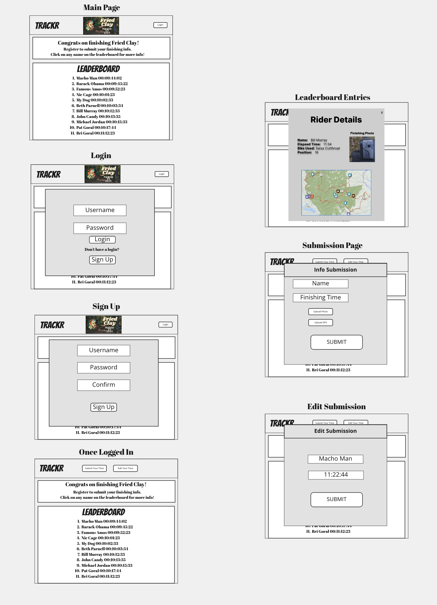

# TRACKR
## An Adventure Race Scoring App

 

### TRACKR is a web app designed to create an interactive leaderboard for self-supported adventure races
---
## Entity Relationship Diagram

 

---
## Wireframe

 

---

## Technologies Used

| Code       |          |
| ---------- | -------- |
| React      | Node     |
| JavaScript | Express  |
| HTML5      | MongoDB  |
| Mongoose   | CSS3     |

## Planning Docs:

### Trello Board:

[View Trello Board](https://trello.com/b/ZFkGbE5Q/project-3)

## Future Goals:

#### Version 2:

-As a user I want to be able to create many events

-As a user I want to be able to invite others to my event

-As a user I want to have a search function for events

#### Version 3:

-As an admin I want to be able to implement payment for my events

-As an admin I want to be able to manage participants

-As a user I want to be able to post my event on social media.